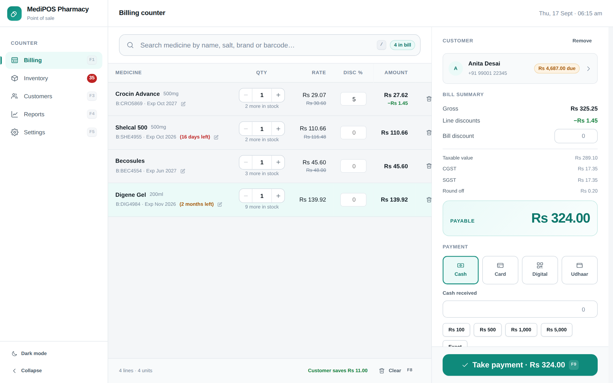
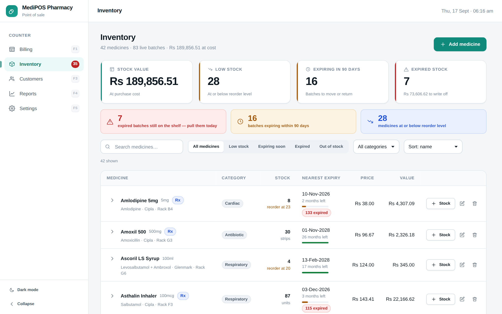
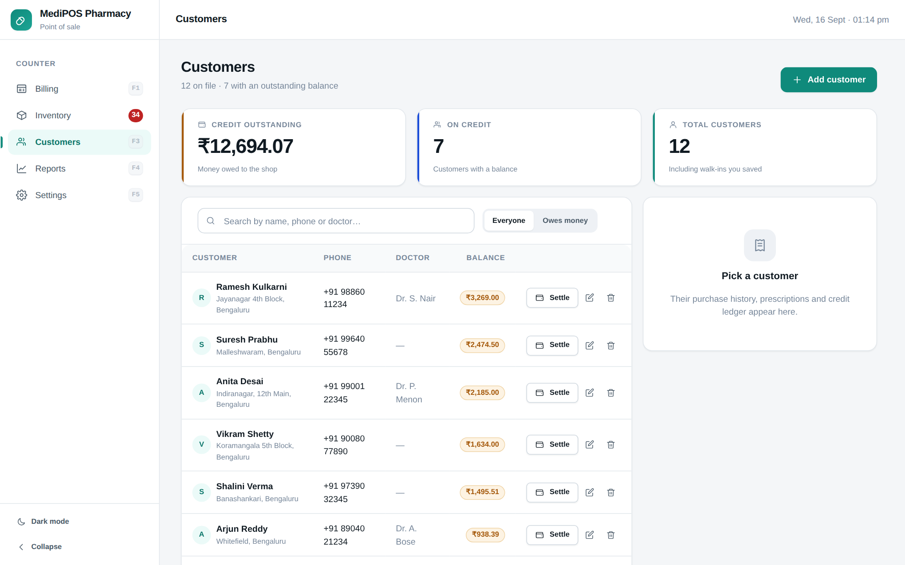
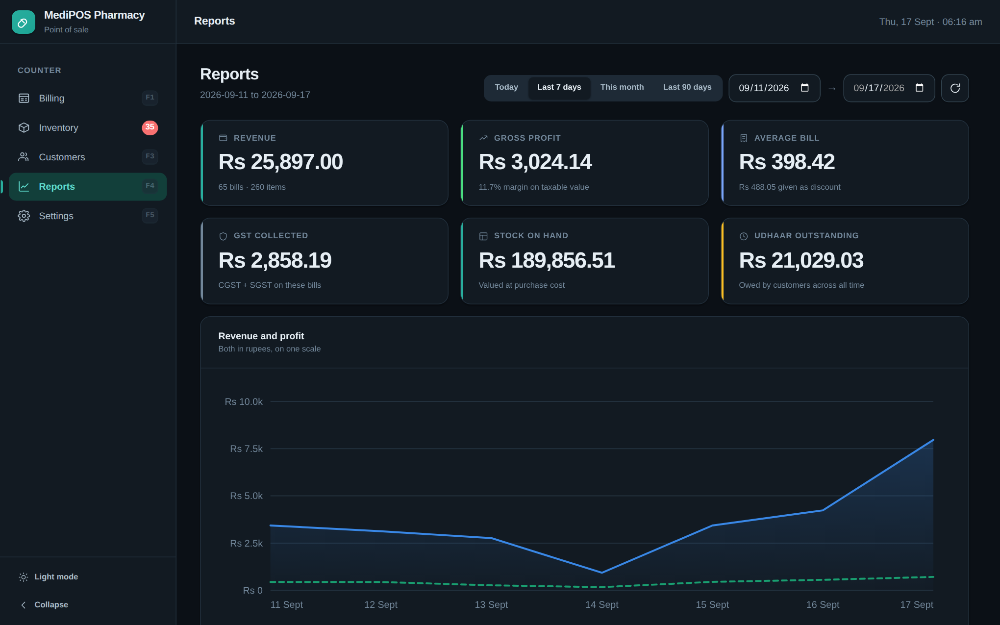
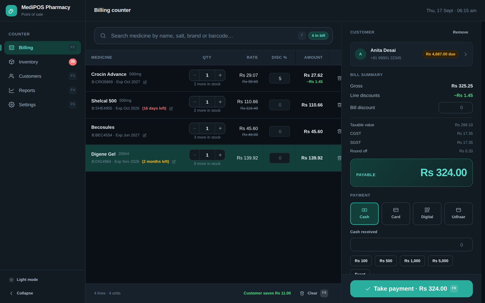
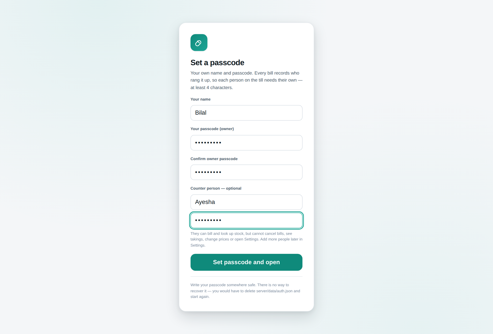
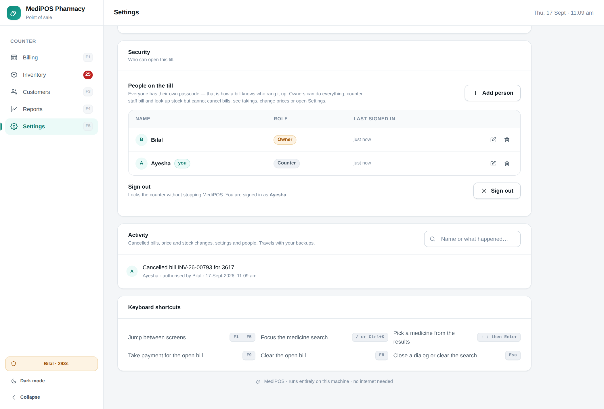
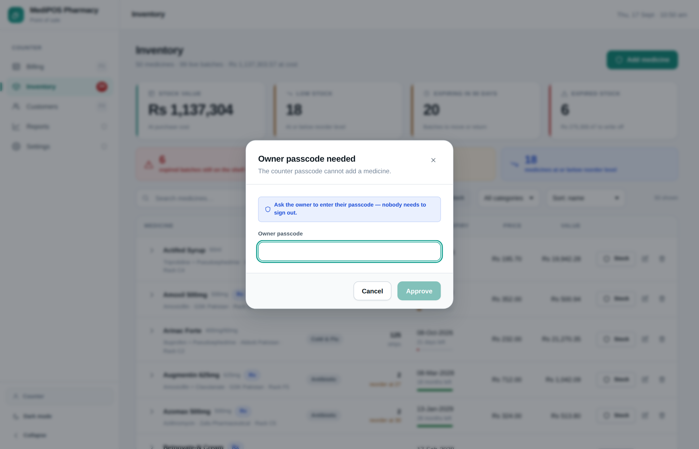
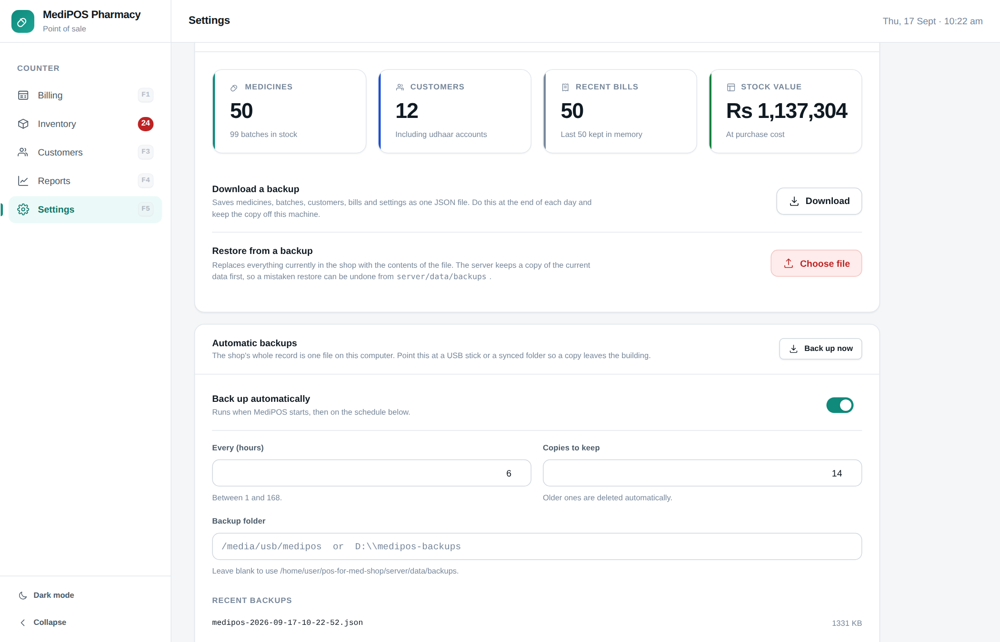
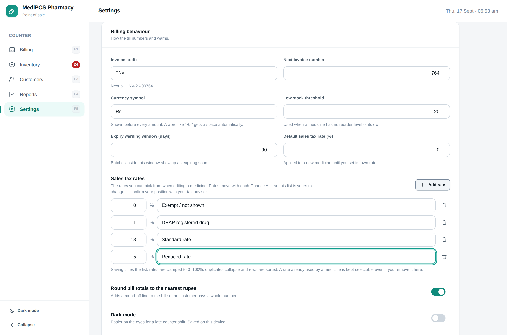

# Dawakhana

A lightweight, offline-first point of sale for a medicine shop. Fast keyboard-driven
billing, batch and expiry tracking, customer udhaar, and a reports dashboard — all
running on one machine with no internet connection and no database server.



## Why it is built this way

A pharmacy counter has particular needs that a generic POS gets wrong:

- **Stock lives on batches, not products.** The same medicine arrives in batches with
  different expiry dates, MRPs and purchase costs. Dawakhana tracks every batch
  separately and defaults each sale to the batch expiring soonest (FEFO), so old stock
  clears before it lapses.
- **Expired medicine must not be sellable.** Expired batches are hidden from the till
  and rejected by the server even if a stale browser tab tries to bill one.
- **Prescription-only medicine needs a paper trail.** Adding an Rx item to a bill makes
  the prescription reference mandatory before payment can be taken.
- **Prices are tax-inclusive.** MRP is printed on the pack, so sales tax is
  *back-calculated* out of the line total rather than added on top, and appears as a
  single line — Pakistan levies one federal sales tax, not a split.
- **The tax rate belongs to the product.** Drugs registered under the Drugs Act 1976
  attract a concessional rate, while devices, cosmetics and general consumables sit at
  the standard rate, so a single shop-wide rate would be wrong. The starting catalogue ships
  registered medicines at 1% and non-drug lines at 18%.
- **Regulars buy on udhaar.** Bills can be part-paid or fully deferred to a customer's
  account, with a ledger and settlement flow.
- **Money is in Pakistani rupees**, formatted `Rs 1,842,424.50`. Four tenders are
  supported: Cash, Credit/Debit Card, Digital (EasyPaisa, JazzCash, QR or bank
  transfer), and Udhaar. Change the symbol from Settings if you need another
  currency — a word-like symbol gets its spacing automatically.

## Putting it on a shop computer

**[install/README.md](install/README.md) is the guide to read** if you are setting this
up on a real till: build, copy, start at boot, kiosk window, backups and the receipt
printer, step by step.

The short version: `npm run package` produces **`dawakhana-shop.zip`** (~270 KB).
Node is installed on the shop computer once, separately; the shop then unzips the
package, double-clicks one `SETUP` file, and gets a **Dawakhana icon on the desktop**
that opens the till in its own window — no terminal, no address bar.

## Running it for development

Requires Node 20 or newer. Nothing else — no database, no Docker, no build toolchain
beyond npm.

```bash
npm install
npm run build     # compile the frontend into dist/
npm start         # serve the app and API on http://localhost:4173
```

The first run writes a **starter catalogue**: 50 medicines from a Pakistani shelf
(Panadol, Augmentin, Risek, Ventolin, Surbex Z and so on), each priced, each with one
batch marked `OPENING` that holds no stock. No customers, no bills, no takings — a real
shop's records belong to that shop. Nothing is sellable until someone enters what is on
the shelf, which is deliberate: a till that ships with invented stock counts is worse
than one that ships with none.

For looking around the app rather than opening a shop, `npm run seed:demo` replaces that
with a shop mid-life — stocked batches, 12 customers and about three months of trade, so
the reports and alerts have something to show. Every number in it is invented; never
hand it to a shop. Delete `server/data/db.json` and restart to go back to the starter
catalogue, or run `npm run seed` to reset it.

### Development

```bash
npm run dev       # API on :4173 + Vite dev server with hot reload on :5173
```

Open <http://localhost:5173>. Vite proxies `/api` through to the Node server.

| Script | What it does |
| --- | --- |
| `npm run dev` | API and hot-reloading UI together |
| `npm run build` | Typecheck, then build the production bundle into `dist/` |
| `npm start` | Serve the built app and the API from one process |
| `npm run seed` | Overwrite the database with a fresh starter catalogue |
| `npm run seed:demo` | Overwrite it with the invented demo shop instead |
| `npm run typecheck` | TypeScript only, no build |
| `npm run package` | Build `dawakhana-shop.zip` for the shop |

Set `PORT` to move the server, and `POS_DATA_DIR` to keep the data somewhere else
(a synced folder, for example).

## Using it

Everything on the billing screen is reachable from the keyboard, because a counter
operator should never have to reach for the mouse mid-queue:

| Key | Action |
| --- | --- |
| `F1` – `F5` | Jump between Billing, Inventory, Customers, Reports, Settings |
| `/` or `Ctrl`+`K` | Focus the medicine search |
| `↑` `↓` then `Enter` | Pick a medicine from the results |
| `F9` | Take payment for the open bill |
| `F8` | Clear the open bill |
| `Esc` | Close a dialog, or clear the search |

Search matches on brand name, generic name (salt), manufacturer and barcode, and
tolerates loose typing — `azith` finds *Azithral 500*. A barcode scanner works with no
extra setup: it types the code and presses Enter, which is exactly the flow above.

### Screens

**Billing** — search, cart with per-line discounts, batch override, customer attach,
cash/card/digital/udhaar tender with change calculation, and a printable 80mm receipt.
Expiry warnings appear on the line itself, so a short-dated pack is never sold by
accident.

**Inventory** — medicines with expandable batch lists, stock value, and one-click
filters for low stock, expiring soon, expired and out of stock.



**Customers** — purchase history, prescription references, udhaar balance and
settlement.



**Reports** — revenue and profit over time, best sellers, payment mix, busiest hours,
a reorder list, and a searchable bill register with CSV export and bill cancellation
(which returns stock and reverses any udhaar).



**Settings** — shop identity for the receipt, billing behaviour, and backup/restore.

Light and dark are both first-class; the theme follows the system by default and is
remembered per device.



## How it is put together

```
server/          zero-dependency Node HTTP server
  index.mjs      routing, static file serving
  api.mjs        REST routes, checkout and reporting logic
  domain.mjs     pricing and stock rules
  db.mjs         JSON file store with atomic writes
  seed.mjs       starter catalogue and demo data generator
  data/db.json   the entire shop (created on first run)
src/             React 19 + TypeScript frontend
  pages/         one file per screen
  components/    UI primitives, forms, charts, receipt
  lib/           API client, types, pricing mirror, formatting
  styles/        design tokens and stylesheets
```

**The server owns the money.** The browser computes live cart totals so the display
updates instantly, but at checkout the server independently revalidates every line
against live stock and expiry, recomputes all totals, and stores its own numbers. A
stale tab or a tampered request cannot decide a bill.

**Writes are atomic and serialised.** `db.json` is written to a temp file and renamed
into place, so a crash mid-write cannot leave a half-written database, and concurrent
requests are queued so they cannot interleave a read-modify-write.

**No runtime dependencies.** The server uses only Node built-ins; the frontend ships
React and nothing else. Icons are inline SVG, charts are hand-drawn SVG, and fonts come
from the system stack — so nothing is fetched over the network at runtime. The whole
production bundle is about 98 kB gzipped.

**Charts are built for colour-blind readers.** Series colours come from a palette
validated for CVD separation against both the light and dark surfaces, and series are
distinguished by line style and written labels as well as hue.

## Who is on the till

Everyone gets their **own passcode**, and that passcode is how Dawakhana knows who they
are — so every bill records who rang it up. Each person is an **owner** or on the
**counter**:

| | Owner | Counter |
| --- | --- | --- |
| Bill, search stock, take udhaar payments | yes | yes |
| Add and edit customers | yes | yes |
| **Cancel a bill** | yes | **no** |
| See takings, profit and best-sellers | yes | no |
| Add stock, change a price or a tax rate | yes | no |
| Delete a medicine, batch or customer | yes | no |
| Open Settings, backups, manage people | yes | no |



Add and remove people in **Settings → People on the till**. Two people can never share
a passcode — the till would not be able to tell them apart, so it refuses. The shop
always keeps at least one owner who can sign in.

Removing someone stops them signing in; it does **not** rewrite history. Bills they
rang up keep their name, because an audit trail that changes retroactively is not one.

### The audit trail

- Every bill records **who rang it up**, shown on the receipt ("Served by: Ayesha"),
  in the bill register, in the CSV export, and summarised per person in Reports.
- Cancelling a bill records **who cancelled it** and, if it went through a manager
  override, **who authorised it**.
- **Settings → Activity** lists the things worth questioning later: cancelled bills,
  price and tax changes, stock adjustments, deletions, settings changes, udhaar
  payments taken, and people added or removed. It is searchable and travels with your
  backups.



### Manager override

Staff are not left at a dead end. When the counter hits something owner-only, Dawakhana
asks for an **owner passcode** right there; the owner walks over, types it, and the
action goes through. Nobody signs out mid-queue.



The override lasts five minutes and shows in the sidebar — naming the owner who
approved it, with a countdown that doubles as a button to end it early. It lifts *that
session* temporarily; it does not change who is signed in, which is why the log can say
"Ayesha cancelled it, authorised by Bilal".

### How it is enforced

The gate is on the **server**, route by route. The UI hides what staff cannot do, but
that is only a courtesy: a staff session that replays a request or types a URL gets a
`403`, because the server checks the session's role on every admin route.

- Passcodes are scrypt hashes in `server/data/auth.json` — deliberately **not** in
  `db.json`, so a backup you email yourself never carries them.
- Five wrong tries triggers a lockout that doubles each time. A correct passcode is
  refused while locked out, so the lockout cannot be walked around.
- Only owners can manage people — otherwise staff could promote themselves.
- Changing someone's passcode, or switching them off, signs them out immediately.
- Sessions live in memory and last a shift. Restarting Dawakhana signs the counter out.
- Forgot the owner passcode? Delete `server/data/auth.json` and restart to start again.
- `POS_AUTH=off` disables the gate entirely, for development or a one-person shop.

A till set up before this keeps working: an older single or shared passcode becomes a
person called *Owner* (and *Counter*), ready to be renamed in Settings.

The server listens on the whole network, so a phone on the shop Wi-Fi can reach it —
the passcodes are the only thing in the way. Use `HOST=127.0.0.1` to bind to the
machine alone.

## Backups



**Settings → Automatic backups.** A dated copy is written when Dawakhana starts and then
on a schedule you set, with old copies pruned to a limit.

**Point the backup folder at a USB stick or a synced folder.** A backup that only
exists on the till is not a backup: the realistic disaster is the laptop being stolen,
dropped or dying, and taking both copies with it.

A backup drive that is missing, full or stalled never stops the shop selling. Every
backup is time-boxed and single-flight, so a half-connected USB stick or an unreachable
network share fails with a message in Settings after 20 seconds rather than hanging the
till. Settings → Data also has a one-click download, and restoring keeps a copy of the
previous state first.

## Limits worth knowing

- Two roles only — owner or counter. There is no finer-grained permission model, and
  no approval workflow beyond the manager override.
- Several browsers can point at one server on the LAN, but there is no locking between
  tills — two people billing the same last packet at the same moment is not handled.
- No purchase orders, supplier ledger, or sales-tax return filing.
- Udhaar is tracked per customer as a running balance, not as an aged-debtor report.
- Sales tax is a single rate per product, chosen from a list you configure. There is
  no separate further-tax, extra-tax or withholding handling, and no sales-tax return
  output.

## Sales tax

Bills show one **Sales tax** line, back-calculated out of the tax-inclusive MRP. The
rate is set per product (Inventory → edit a medicine → Sales tax rate).

**Nothing about tax is hardcoded.** Settings → Billing behaviour holds both:

- **The rate list** — the options offered when editing a medicine. Add, remove or
  relabel rows as your position changes. Saving tidies the list: rates are clamped to
  0–100%, duplicates collapse and rows sort by rate. A rate already used by a medicine
  stays selectable even if you delete it here, so removing a row can never silently
  re-tax stock you have already priced.
- **The default rate** applied to a newly added medicine until you give it its own.



A new shop starts with three rows and a **0% default**:

| Rate | For |
| --- | --- |
| `0%` | Exempt, or tax already discharged upstream and not shown again |
| `1%` | Drugs registered under the Drugs Act 1976 — the concessional rate |
| `18%` | Standard rate: devices, cosmetics, general consumables |

A caveat worth reading before you trade on this. Pakistan charges DRAP-registered
allopathic medicines a concessional **1%** under Entry 81 of Table-I of the Eighth
Schedule to the Sales Tax Act 1990, and that tax is treated as a **final discharge in
the supply chain** — collected by the manufacturer or importer, with no input-tax
adjustment further down. So a retail chemist is often not adding output tax on those
lines at all, and `0%` may represent your position better than `1%`. Non-drug goods
carry the standard 18%.

These rates move with every Finance Act, and there have been active budget proposals
to zero-rate registered pharmaceuticals. **Confirm your own position with your tax
adviser and set the rates accordingly** — the app makes both the list and the default
editable precisely because they are not ours to assume. The default ships at 0% for
that reason. Enter your NTN and STRN in Settings; each is
omitted from the receipt while blank rather than printing something false.

Sources: [FBR clarification on the 1% rate](https://www.brecorder.com/news/40209257),
[sales tax structure for pharmaceuticals](https://www.brecorder.com/news/40247020),
[tax rules for a pharmacy business](https://sohaibnsultan.pk/tax-laws-applying-to-a-pharmacy-business-in-pakistan-a-complete-guide-for-2026/).
